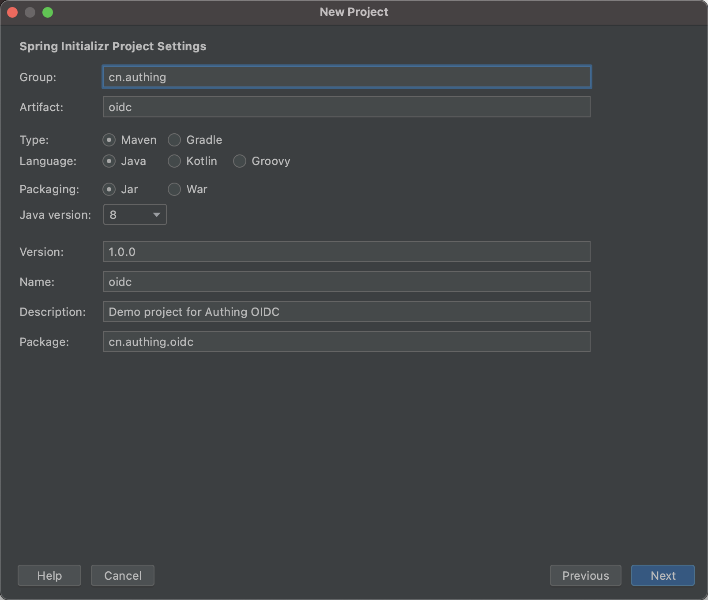
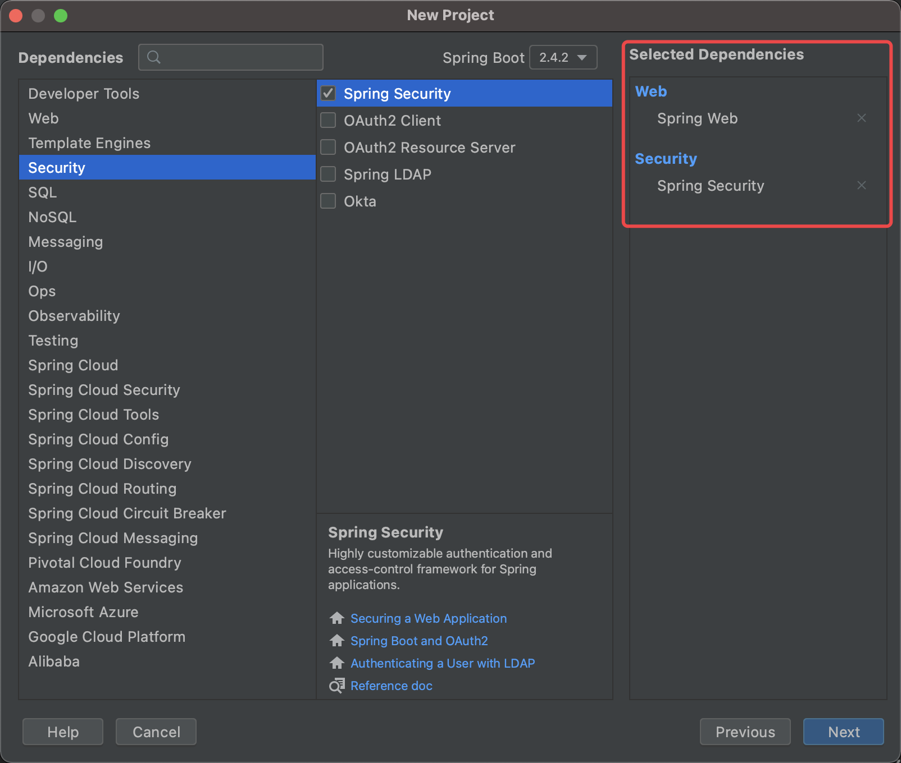
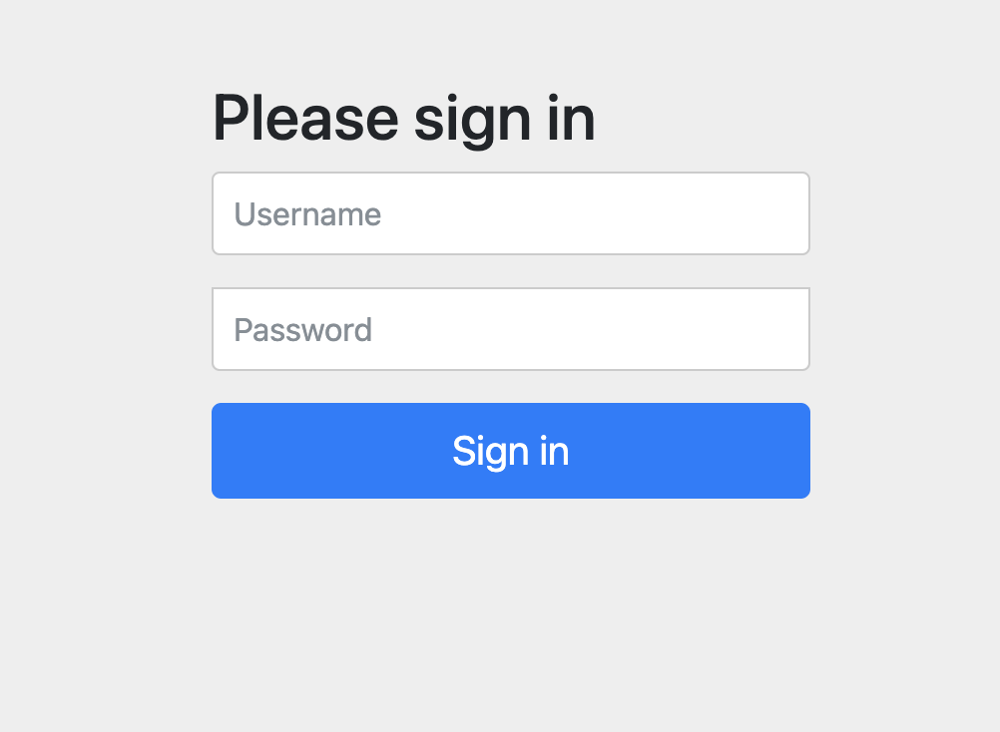
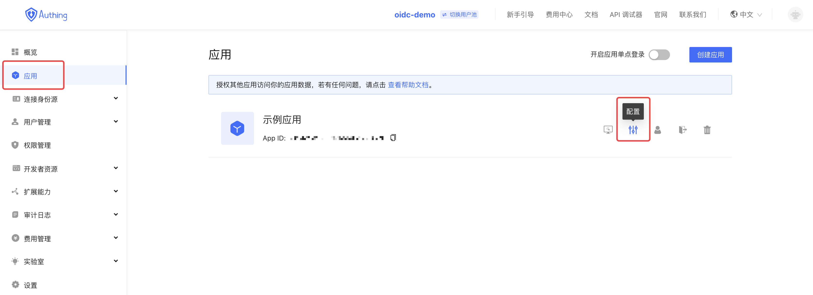
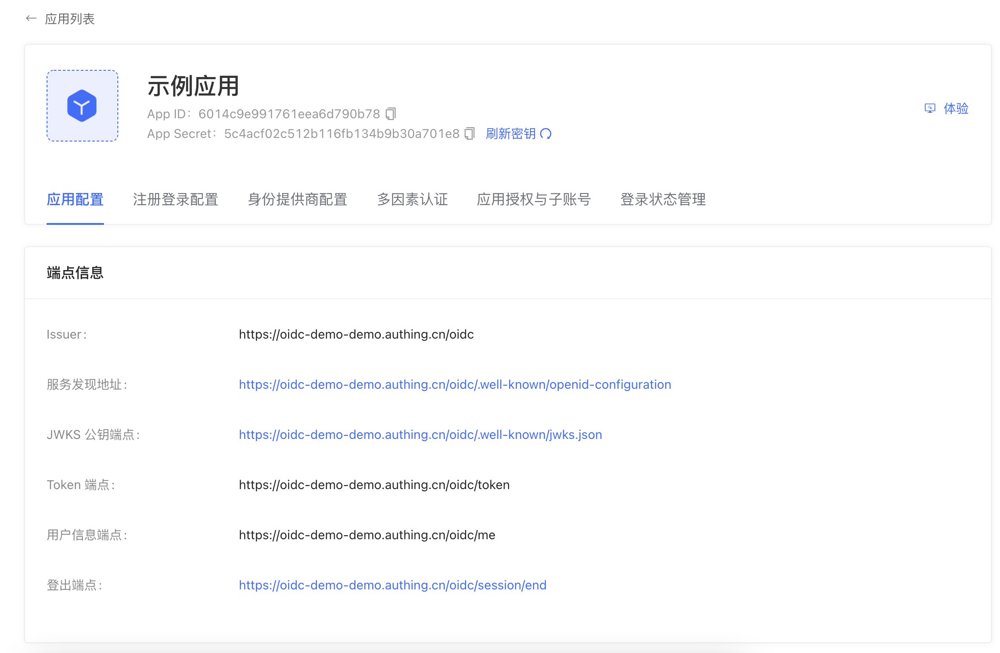

# 手把手教你使用 Spring Security5 集成 Authing 登录
> 本文以 Spring 生态中用于提供认证及访问权限控制的 Spring Security5 为例，详细介绍 Spring Security5 如何接入 Authing OIDC。

Spring Security 是一个能够为基于 Spring 的企业应用系统提供声明式的安全访问控制解决方案的安全框架。它提供了一组可以在 Spring 应用上下文中配置的 Bean，充分利用了 Spring IoC，DI（控制反转 Inversion of Control ,DI:Dependency Injection 依赖注入）和 AOP（面向切面编程）功能，为应用系统提供声明式的安全访问控制功能，减少了为企业系统安全控制编写大量重复代码的工作。

Spring Security 的主要功能主要包括：
- 认证
- 授权
- 攻击防护

下面将详细介绍使用 Spring Security5 集成 Authing 登录的方法：

## 1.  初始化 Spring boot 项目
打开 IDEA，点击 New Project 创建一个新项目，选择 Spring Initializr 创建一个 Spring Boot 项目。


输入项目的 Group 以及 Artifact 信息。



添加 Spring Web,  Spring Security 依赖。



创建好项目后，在 IDEA 中运行项目。

在项目运行后，使用浏览器访问 [localhost:8080](http://localhost:8080) 会自动跳转到 /login，可以看到页面上出现了一个基础的登录表单，说明项目初始化成功。



## 2.  配置 Authing

首先要在 Authing 注册一个账号，然后进入控制台，按照引导步骤新建一个用户池。

点击左侧的「应用」 菜单项，在右侧会看到一个默认创建好的应用。



点击「配置」，看到 App ID、App Secret 和 Issuer url，请妥善保存，之后会用到这些信息。



然后需要在回调地址处添加 [http://localhost:8080/login/oauth2/code/authing](http://localhost:8080/login/oauth2/code/authing) 之后的选项与下图中保持一致。


## 3. 配置 Spring Security

回到项目中，找到 src/main/resources/application.properties，将其重命名为 application.yml，并添加如下内容：

```yaml
spring:
  thymeleaf:
    cache: false
  security:
    oauth2:
      client:
        registration:
          authing:
            client-id: {clientId}
            client-secret: {secret}
            redirect-uri: '{baseUrl}/login/oauth2/code/{registrationId}'
            client-authentication-method: post
            scope:
              - openid
              - profile
        provider:
          authing:
            issuer-uri: {issuerUrl}
            user-name-attribute: preferred_username
```

需要将这里的 {clientId}、{secret}、{issuerUrl} 替换成上一步 *应用配置* 中的实际信息。
接下来需要在 pom.xml 中添加一些依赖并更新：

```xml
<dependency>
   <groupId>org.springframework.security</groupId>
   <artifactId>spring-security-config</artifactId>
</dependency>
<dependency>
   <groupId>org.springframework.security</groupId>
   <artifactId>spring-security-oauth2-client</artifactId>
</dependency>
<dependency>
   <groupId>org.springframework.security</groupId>
   <artifactId>spring-security-oauth2-jose</artifactId>
</dependency>
```

一切准备就绪了，现在启动项目并访问 [localhost:8080](http://localhost:8080)，即可看到 Authing 登录窗口。


Spring Security 默认会保护首页，在访问首页时会进行认证，未认证的访问请求会跳转到 /login。
注册并登录后，会跳转回首页，此时可以看到页面上的欢迎语显示了当前登录用户的用户名。


